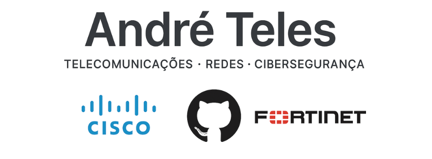

<h1 align="center">Olá, sou o André Teles 👋</h1>

Técnico de Redes e Telecomunicações | Cisco | VOIP | Cibersegurança | Fortinet  

---

### 📌 Sobre mim

Sou Técnico de Redes e Telecomunicações com mais de 18 anos de experiência em ambientes empresariais críticos. Trabalho com soluções Cisco, Huawei, Fortinet, VOIP, redes móveis/fixas, servidores Windows e tenho um grande foco em **cibersegurança ofensiva e redes IP seguras**.

Atualmente a frequentar formações avançadas em **Suporte e Segurança de Rede** (Cisco) e **Fortinet Certified Fundamentals**.

---

### 🎓 Formações e Certificações

- 📘 **CCNA - Cisco Routing & Switching**  
- 📘 **Huawei Routing & Switching**  
- 📘 **Windows Server 2022**  
- 📘 **Red Team – Cibersegurança Ofensiva (Univ. Aberta)**  
- 📘 **Hardware Informático e Redes Estruturadas**  
- 📘 **Fortinet NSE1 & NSE2**  
- 📘 **TryHackMe – Cybersecurity & Pentesting Labs**  
- 📘 **ITED / ITUR - Redes físicas e instalação**

> 📚 Em curso:
> - Suporte e Segurança de Rede – Cisco (2026)  
> - Fortinet Certified Fundamentals – FCF (2026)

---

### ⚙️ Conhecimentos Técnicos

| Áreas | Tecnologias |
|-------|-------------|
| Redes IP & VOIP | Cisco, Huawei, Fortinet, Yealink |
| Routing & Switching | VLANs, OSPF, EIGRP, NAT, ACLs |
| Cibersegurança | Pentesting básico, NSE1/NSE2, TryHackMe |
| Redes móveis/fixas | 2G, 4G, 5G, GPON, CATV |
| Servidores | Windows Server, AD, DNS, DHCP |
| Instalações | Redes estruturadas, Wi-Fi empresarial, ITED/ITUR |

---

### 📂 Repositórios em Destaque

🔹 [`CCNA`](https://github.com/andre2023-pt/Cisco_Labs_Config)  
🔹 [`Cybersecurity`](https://github.com/andre2023-pt/Cybersecurity_Notes)

---

### 📫 Contacto

📍 Montijo, Portugal  
📧 andre.fnt15@gmail.com  
🔗 [LinkedIn](https://linkedin.com/in/andre-teles-3b5558182)

---

🛠️ *Sempre a aprender. Sempre a construir. Sempre a partilhar.*

## 🕹️ Pac‑Man no meu Gráfico de Contribuições

<picture>
  <source media="(prefers-color-scheme: dark)" srcset="https://raw.githubusercontent.com/andre2023-pt/andre2023-pt/output/pacman-contribution-graph-dark.svg">
  <source media="(prefers-color-scheme: light)" srcset="https://raw.githubusercontent.com/andre2023-pt/andre2023-pt/output/pacman-contribution-graph.svg">
  
</picture>

🎮 Gerado com [pacman‑contribution‑graph](https://abozanona.github.io/pacman-contribution-graph/)

